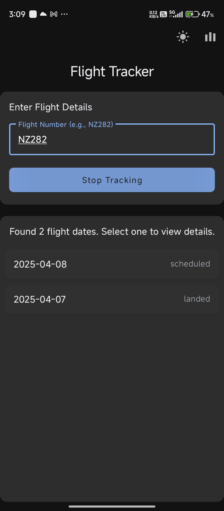
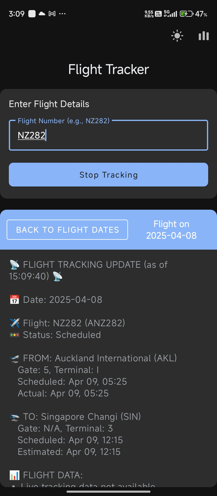
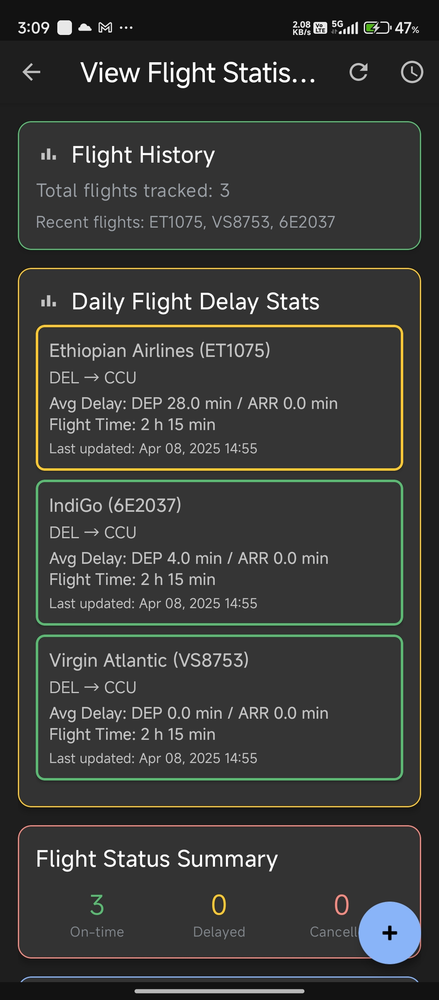
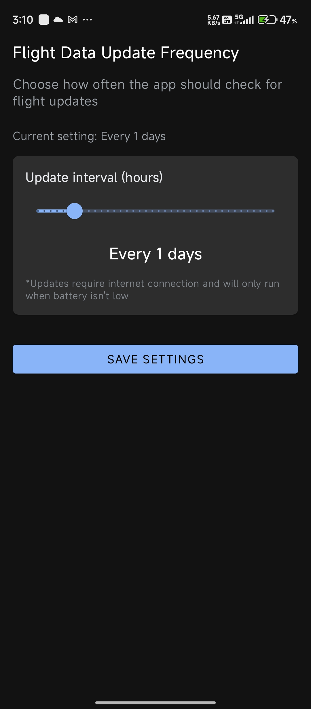

# SkyTrackr-Android

A comprehensive Android application for tracking flights, monitoring flight delays, and analyzing flight statistics in real-time.

## Table of Contents
- [Features](#features)
- [Screenshots](#screenshots)
- [Architecture](#architecture)
- [Project Structure](#project-structure)
- [App Workflow](#app-workflow)
- [Technologies Used](#technologies-used)
- [Setup and Installation](#setup-and-installation)
- [License](#license)
- [Acknowledgements](#acknowledgements)

## Features

- **Flight Tracking by Number**
  - Search and track specific flights using flight number (e.g., BA123)
  - Real-time flight status updates
  - Display of flight details including departure/arrival times
  - View flight position data (coordinates, altitude, speed)

- **Flight Route Tracking**
  - Search flights by departure and arrival airports (IATA codes)
  - View all flights operating between selected airports
  - Highlight specific flights of interest

- **Flight Statistics and Analytics**
  - Track flight delay statistics and trends
  - View most delayed flights
  - Analyze performance by airline and route
  - Monitor on-time vs. delayed vs. cancelled flights

- **Background Updates**
  - Periodic flight data updates in the background
  - Customizable update frequency
  - Battery optimization handling for reliable updates

- **User Interface**
  - Material Design 3 components
  - Support for both light and dark themes
  - Smooth animations and transitions
  - Collapsible JSON viewer for API responses

## Screenshots

### Main flight tracking screen  


### Flight route search results  


### Flight statistics dashboard  


### Background service settings  


### Theme toggle demonstration (light/dark)  


## Architecture

The app follows the MVVM (Model-View-ViewModel) architecture pattern:

### Architectural Components

- **Views**: Activities and XML layouts that display the UI  
- **ViewModels**: Manage UI-related data and handle user interactions  
- **Repositories**: Provide a clean API for data access  
- **Room Database**: Local persistence for flight data  
- **WorkManager**: Background processing for flight updates

### Flow Diagram

`User Input → Activity → ViewModel → Repository → API/Database ↔ Model ↑ ↑ ↓ UI LiveData Data`

## Project Structure

```
app/
├── src/
│   ├── main/
│   │   ├── java/com/flight/flightq1/
│   │   │   ├── adapter/
│   │   │   │   ├── FlightDateAdapter.kt
│   │   │   │   ├── FlightRouteAdapter.kt
│   │   │   │   ├── FlightStatsAdapter.kt
│   │   │   │   ├── HighlightedFlightAdapter.kt
│   │   │   │   └── RouteHistoryAdapter.kt
│   │   │   ├── api/
│   │   │   │   ├── AirportFlightApiService.kt
│   │   │   │   ├── CustomDns.kt
│   │   │   │   ├── FlightApiService.kt
│   │   │   │   └── NetworkConnectionInterceptor.kt
│   │   │   ├── db/
│   │   │   │   ├── FlightDatabase.kt
│   │   │   │   ├── FlightRouteDao.kt
│   │   │   │   ├── FlightRouteEntity.kt
│   │   │   │   ├── FlightStatsDao.kt
│   │   │   │   └── FlightStatsEntity.kt
│   │   │   ├── model/
│   │   │   │   ├── FlightData.kt
│   │   │   │   └── FlightResponse.kt
│   │   │   ├── repository/
│   │   │   │   ├── AirportFlightRepository.kt
│   │   │   │   ├── FlightRepository.kt
│   │   │   │   └── FlightStatsRepository.kt
│   │   │   ├── util/
│   │   │   │   ├── BatteryOptimizationHelper.kt
│   │   │   │   └── NetworkUtils.kt
│   │   │   ├── viewmodel/
│   │   │   │   ├── AirportFlightViewModel.kt
│   │   │   │   └── FlightViewModel.kt
│   │   │   ├── worker/
│   │   │   │   └── FlightUpdateWorker.kt
│   │   │   ├── FlightModels.kt
│   │   │   ├── FlightQApplication.kt
│   │   │   ├── FlightRouteResultsActivity.kt
│   │   │   ├── FlightStatisticsActivity.kt
│   │   │   ├── JsonBottomSheetFragment.kt
│   │   │   └── MainActivity.kt
│   │   └── res/
│   │       ├── layout/
│   │       │   ├── activity_flight_route_results.xml
│   │       │   ├── activity_flight_statistics.xml
│   │       │   ├── activity_main.xml
│   │       │   ├── dialog_battery_optimization.xml
│   │       │   ├── item_flight_stats.xml
│   │       │   ├── item_route_history.xml
│   │       │   └── layout_json_bottom_sheet.xml
│   │       ├── drawable/
│   │       │   ├── ic_battery_optimization.xml
│   │       │   ├── ic_light_mode.xml
│   │       │   ├── ic_statistics.xml
│   │       │   └── ic_stats.xml
│   │       ├── anim/
│   │       │   ├── rotate_up.xml
│   │       │   ├── slide_down.xml
│   │       │   └── slide_up.xml
│   │       ├── menu/
│   │       │   ├── flight_statistics_menu.xml
│   │       │   └── main_menu.xml
│   │       └── values/
│   │           ├── colors.xml
│   │           ├── strings.xml
│   │           ├── styles.xml
│   │           └── themes.xml
│   └── build.gradle
```

## App Workflow

### 1. Main Screen (`MainActivity`)
- User enters a flight number  
- App fetches flight data from API  
- If multiple flight dates are available, user selects a specific date  
- Flight details are displayed with status, times, and position  
- User can toggle tracking mode to receive updates  

### 2. Flight Statistics (`FlightStatisticsActivity`)
- Dashboard view with flight statistics cards:
  - Flight History: Total flights tracked and recent flights
  - Flight Status Summary: Counts for on-time, delayed, and cancelled flights
  - Most Delayed Flights: List of flights with significant delays
  - Route History: Previously searched flight routes
  - Highlighted Flights: User-selected important flights

### 3. Route Search (`FlightRouteResultsActivity`)
- User enters departure and arrival airport codes (IATA)  
- App displays all flights between these airports  
- User can highlight specific flights for monitoring  
- Raw API response can be viewed in a JSON viewer  
- Flight data is stored in local database for offline viewing  

### 4. Background Updates
- `WorkManager` schedules periodic flight data updates  
- User can configure update frequency in settings  
- Battery optimization dialog helps ensure reliable updates  
- Notifications inform user of significant flight status changes  

## Technologies Used

- **Kotlin** - Primary programming language  
- **Android Jetpack Components**
  - LiveData - Observable data holder  
  - ViewModel - UI state management  
  - Room - SQLite database abstraction  
  - WorkManager - Background processing  
  - Material Design 3 - UI components

- **Networking**
  - Retrofit 2.11.0 - Type-safe HTTP client  
  - OkHttp 4.12.0 - HTTP client with interceptors  
  - Gson 2.10.1 - JSON parsing and serialization

- **Asynchronous Programming**
  - Coroutines - Asynchronous code with sequential logic  
  - Flow - Reactive streams

- **Persistence**
  - Room Database - Local storage for flight data  
  - Shared Preferences - User settings storage

- **UI Components**
  - Material Components - Material Design implementation  
  - RecyclerView - Efficient list display  
  - ConstraintLayout - Flexible UI layouts  
  - CardView - Card-based UI components

## Setup and Installation

### Prerequisites
- Android Studio (Arctic Fox or newer)  
- JDK 11 or higher  
- Android SDK 35 or higher

### Building the Project

1. Clone the repository:
   ```bash
   git clone https://github.com/namit22315/Flight-Tracker.git
   ```

2. Open the project in Android Studio  
3. Sync Gradle files  
4. Build and run the application on an emulator or physical device  

### API Configuration

The app uses flight tracking APIs which may require API keys. Configure your API key in:  
- `AirportFlightApiService.kt`  
- `FlightApiService.kt`  


## Acknowledgements

- Flight data provided by https://aviationstack.com/
- Icons from Material Design

---

