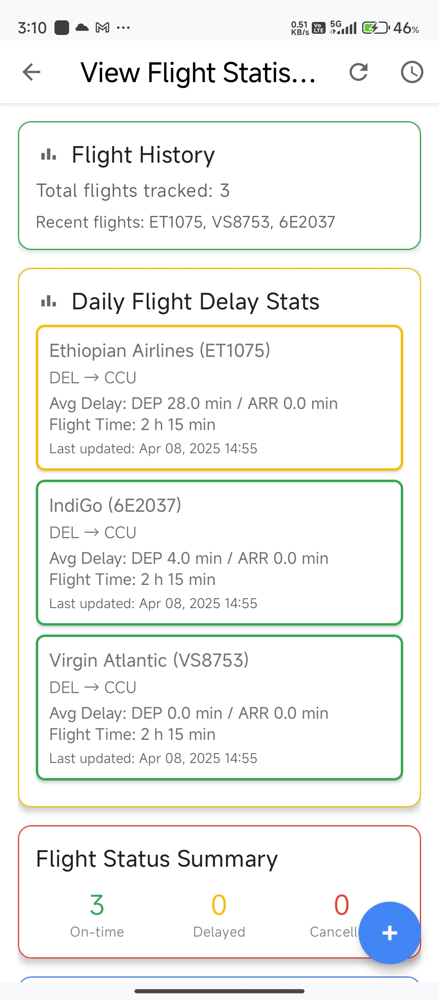

# ✈️ SkyTrackr-Android

[](https://developer.android.com/)
[](https://kotlinlang.org/)
[](./LICENSE)

> A powerful and sleek Android application to **track flights**, monitor **real-time delays**, and **analyze aviation statistics** with a modern UI built using **Kotlin & MVVM**.

---

## 📽️ Demo

https://user-images.githubusercontent.com/your-username/demo-video.mp4  
*(Add your demo video here, hosted on GitHub or YouTube)*

---

## 🖼️ Screenshots

| Main Screen | Flight Route Search | Statistics Dashboard |
|------------|---------------------|----------------------|
|  |  |  |

| Background Service | Light/Dark Theme |
|--------------------|------------------|
|  |  |

---

## 🚀 Features

✅ **Flight Tracking by Number**  
✅ **Route-based Flight Search**  
✅ **Flight Delay Analytics**  
✅ **Periodic Background Updates**  
✅ **Material 3 UI with Theme Toggle**  
✅ **Collapsible JSON Response Viewer**  

---

## 🏗️ Architecture

This app follows a clean **MVVM architecture** with a clear separation of concerns.

```

User Input
↓
Activity → ViewModel → Repository → API/Database
↑            ↑              ↓
UI       LiveData        Room/Retrofit

```

---

## 🧩 Project Structure

<details>
<summary>Click to expand</summary>

```

app/
├── adapter/
├── api/
├── db/
├── model/
├── repository/
├── util/
├── viewmodel/
├── worker/
├── MainActivity.kt
├── FlightRouteResultsActivity.kt
├── FlightStatisticsActivity.kt
├── JsonBottomSheetFragment.kt
├── FlightQApplication.kt
├── res/
│   ├── layout/
│   ├── drawable/
│   ├── anim/
│   ├── menu/
│   └── values/
└── build.gradle

````
</details>

---

## 📲 App Workflow

### 1. **MainActivity** – Search by Flight Number  
→ Real-time tracking + Multiple date support + Position info

### 2. **FlightStatisticsActivity** – Dashboard for Analytics  
→ Flight status summary, most delayed flights, and route history

### 3. **FlightRouteResultsActivity** – Search by Airport  
→ Enter IATA codes → Show all flights between airports → Highlight

### 4. **WorkManager** – Background Flight Update  
→ Customizable update interval + Notifications + Battery optimized

---

## 🛠️ Tech Stack

| Domain | Tech |
|--------|------|
| **Language** | Kotlin |
| **Architecture** | MVVM |
| **UI/UX** | Material 3, Animations, Dark Mode |
| **Async** | Kotlin Coroutines + Flow |
| **Database** | Room |
| **Networking** | Retrofit + OkHttp + Gson |
| **Background Work** | WorkManager |
| **Persistence** | SharedPreferences |

---

## ⚙️ Setup and Installation

### Prerequisites

- ✅ Android Studio (Arctic Fox or newer)  
- ✅ JDK 11+  
- ✅ Android SDK 35+

### Clone and Run

```bash
git clone https://github.com/namit22315/Flight-Tracker.git
cd Flight-Tracker
````

* Open in Android Studio
* Sync Gradle & Build
* Run on emulator or physical device

### API Configuration

Update your API keys in:

* `AirportFlightApiService.kt`
* `FlightApiService.kt`

> Note: You can use [aviationstack](https://aviationstack.com/) or any other provider.

---

## 📄 License

This project is licensed under the [MIT License](./LICENSE).

---

## 🙏 Acknowledgements

* ✈️ Flight data from [aviationstack](https://aviationstack.com/)
* 🎨 Icons from [Material Design Icons](https://fonts.google.com/icons)

---

> Crafted with 💙 by [Namit Jain](https://github.com/Namitjain07)
> Feel free to ⭐ the repo and contribute!


